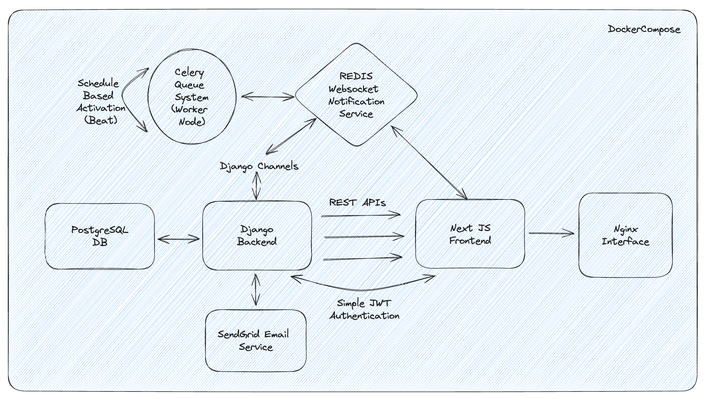
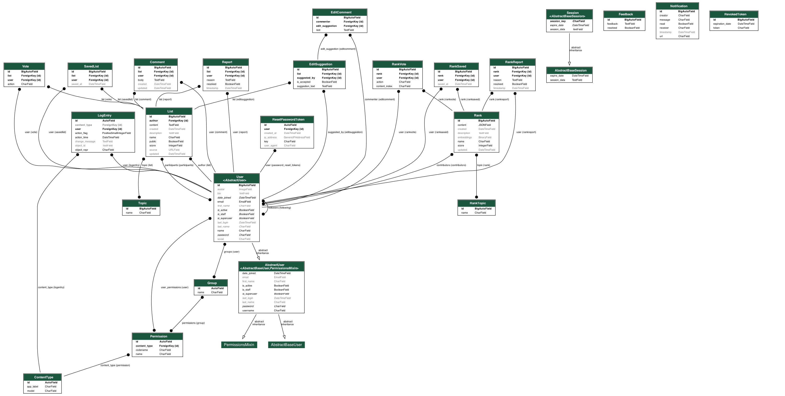

# Sapiens link

This project is built with [Next.js](https://nextjs.org/) and [Django](https://www.djangoproject.com/).

The overall architecture design can be found below:



# Docker Setup Option

Once installed Docker on your local machine, run the following command from the root of the project:

`DB_USER='YOUR_USER_NAME' DB_PASSWORD='YOUR_USER_PASSWORD' docker-compose up`

Before running this command, make sure you have a `app_secrets.py` file in the backend directory and to have removed any pre-existing .next, node_modules folders from the frontend folder.

```
SENDGRID_API_KEY = 'YOUR_SENDRY_API_KEY'
POSTGRESQL_USERNAME = 'YOUR_USER_NAME'
POSTGRESQL_PASSWORD = 'YOUR_USER_PASSWORD'
FROM_EMAIL = 'YOUR_SENDGRID_FROM_EMAIL'
GOOGLE_CLIENT_ID = 'YOUR_GOOGLE_CLIENT_ID'
GOOGLE_CLIENT_SECRET = 'YOUR_GOOGLE_CLIENT_SECRET'
DJANGO_SECRET_KEY = 'YOUR_DJANGO_SECRET_KEY'
```

If you want to rebuild making sure to not cache anything use: `DB_USER='admin' DB_PASSWORD='password' docker-compose build --no-cache` first. Or if need to clear everything use `docker system prune --volumes`.

The Django frontend should be accessible from [localhost:8001](http://localhost:8001/), the Next.js frontend from [localhost:3001](http://localhost:3000/) and the Nginx frontend from [localhost](http://localhost/)

To create an admin user, run these commands from the terminal and follow the instructions:

```
docker exec -it sapienslink_django_1 /bin/bash
python manage.py createsuperuser
```

Once created the admin user you can then access the admin panel from [this address](http://localhost/admin/).

To clear resources after usage use: `docker-compose down -v`.

# Local Setup Option

## Django Backend

Run a django project with `python manage.py runserver` from the backend folder.

You might need to create a local DB and/or superuser credentials to access the admin panel.

## Make sure to work in your virtualenv in the backend folder

If you don't have virtualenv installed use: `pip install virtualenv`.

For the first usage, to create a virtualenv called venv, use `virtualenv venv` from command line.

Then every time you are developing make sure to first activate your virtualenv using `source venv/bin/activate` (for Mac/Linux, for Windows use: `.env\Scripts\activate.bat`).

After you install any Python package, use `pip freeze > requirements.txt`.

If you need to install any missing package someone else might have added since your last contribution, then use: `pip install -r requirements.txt`.

Once finished developing use: `deactivate`.

NOTE: for this project we use 2 key requirements files: requirements-base.txt and requirements-ml.txt which combined together give requirements-all.txt which can be used to run the Django application locally.

## PostgreSQL (Create Your Local DB in the backend folder)

To install postgresql on Mac and the Pgadmin user interface use the following commands:

`brew install postgresql`

`brew install --cask pgadmin4`

Finally, make sure your environment is up to date with the requirements.txt file.

Now open pgadmin4, click on servers, register servers, then choose a name for the server. For host name/address put localhost, port 5432, and choose an username/password (if needed, create a user for the database by using the Login/Group Roles tab in the Server from where you can also specify its permissions). Now we can create a database and specify its name and access in the app_secrets.py.

Once created the database and accordingly updated the settings.py file we can run the following commands:

`python manage.py makemigrations` (create db migration files based on the Django models)

`python manage.py migrate` (apply migration files to db)

`python manage.py migrate auth`

`python manage.py migrate --run-syncdb` (sync db schema with state of Django models)

The server can then be launched using: `python manage.py runserver` and the front end reachable at [http://127.0.0.1:8000](http://127.0.0.1:8000).

## Visualizing the database

In order to create a snapshot of the database architecture, the following command can be used: `python manage.py graph_models -a sapinesApp -o ../db.png` from the backend folder.



### Create Superuser

If you want to create a superuser account to access the admin interface, run the following commands:

- `python manage.py createsuperuser`

Add an email address and a password as requested.

The superuser is a special type of user with elevated privileges, typically used for administering and managing the application.

Access the admin panel by navigating to [http://127.0.0.1:8000/admin](http://127.0.0.1:8000/admin) and login with your superuser credentials

## Run Redis Server (notifications and task execution)

In order to have the web application notification system up and running, you need to make sure to have the Redis Server up and running (opening a new terminal window in the backend folder and running the following command):

- `redis-server`

## Celery

Celery is a distributed task queue system which can be used to schedule recurring tasks (e.g. clearing up read notifications, etc.). In order to be correctly working we
need to have the celery worker (executing tasks) and beat (scheduling periodic tasks at the specified intervals) running in two separate terminal windows (both from the backend folder) using the following commands:

- `celery -A sapiensLink worker --loglevel=info`
- `celery -A sapiensLink beat --loglevel=info`


## Accessing the API Documentation

The SapiensLink API documentation is available through [Django default interface](http://127.0.0.1:8000/api/), [Swagger UI](http://127.0.0.1:8000/api/swagger/) and [Redoc](http://127.0.0.1:8000/api/redoc/).

To test secured endpoints for example using Swagger UI, when clicking Authorize, in the token filed make sure to type `Bearer YOUR ACCESS TOKEN`. An access token can for example be generated by creating an account on the platform and then using [this interface](http://127.0.0.1:8000/api/token/) to login and get the tokens.

## React Frontend

Run a React project with `npm run start` from the _frontend_ folder.

To run a React project, you need to install its dependencies first. </br>
Inside the _frontend_ folder, run `npm install`.

If you need to fetch data from the Django server, you will need to:

- run React with `npm start` from the _frontend_ folder
- run Django with `python manage.py runserver` from the sapiensLink folder. You might also need to create your local DB as reported above.
