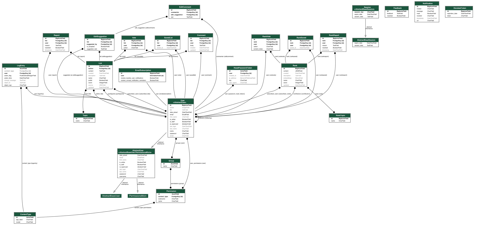

# Sapiens link

This project is built with [Django](https://www.djangoproject.com/).

Run a django project with `python manage.py runserver`

You might need to create a local DB and/or superuser credentials to access the admin panel.

## Make sure to work in your virtualenv

If you don't have virtualenv installed use: `pip install virtualenv`.

For the first usage, to create a virtualenv called venv, use `virtualenv venv` from command line.

Then every time you are developing make sure to first activate your virtualenv using `source venv/bin/activate` (for Mac/Linux, for Windows use: `.env\Scripts\activate.bat`).

After you install any Python package, use `pip freeze > requirements.txt`.

If you need to install any missing package someone else might have added since your last contribution, then use: `pip install -r requirements.txt`.

Once finished developing use: `deactivate`.

## Create Your Local DB

Run the following commands:

- `python manage.py makemigrations` (create db migration files based on the Django models)
- `python manage.py migrate` (apply migration files to db)
- `python manage.py migrate --run-syncdb` (sync db schema with state of Django models)

The server can then be launched using: `python manage.py runserver` and the front end reachable at [http://127.0.0.1:8000](http://127.0.0.1:8000).

## Create Superuser

If you want to create a superuser account to access the admin interface, run the following commands:

- `python manage.py createsuperuser`

Add an email address and a password as requested.

The superuser is a special type of user with elevated privileges, typically used for administering and managing the application.

Access the admin panel by navigating to [http://127.0.0.1:8000/admin](http://127.0.0.1:8000/admin) and login with your superuser credentials

## Run Redis Server

In order to have the web application notification system up and running, you need to make sure to have the Redis Server up and running (opening a new terminal window at the root of the project and running the following command):

- `redis-server`

## Visualizing the database

In order to create a snapshot of the database architecture, the following command can be used: `python manage.py graph_models -a sapinesApp -o db.png`

## PostgreSQL

To install postgresql on Mac and the Pgadmin user interface use the following commands:

`brew install postgresql`

`brew install --cask pgadmin4`

Finally, make sure your environment is up to date with the requirements.txt file.

Now open pgadmin4, click on servers, register servers, then choose a name for the server. For host name/address put localhost, port 5432, and choose an username/password. Now we can create a database.

Once created the database and accordingly updated the settings.py file we can run the following commands:

`python manage.py makemigrations`
`python manage.py migrate`
`python manage.py migrate auth`
`python manage.py migrate --run-syncdb`
`python manage.py runserver`